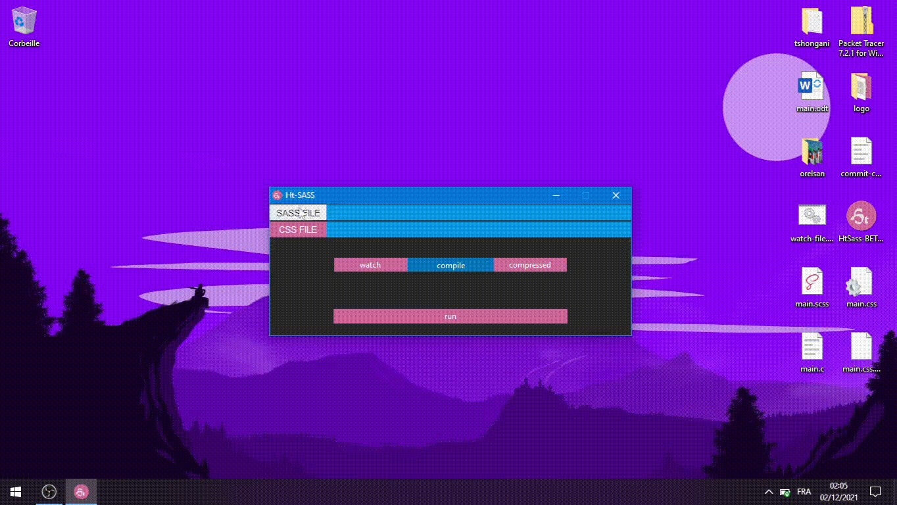

# HtSass

HtSass is a graphical application for the Sass preprocessor. It uses the dark-sass compiler that you can find here: [dart-sass](https://github.com/sass/dart-sass/releases)

I made this application as part of a challenge which consisted in making an application with the native libraries of the language. 



## dart-sass

You need to install dark-sass, unpack it and place it in the src folder.

```
├───src
│   ├───dart-sass
│   │   └───src
```

For linux and mac users, you can modify these lines in the cmd file; i think it will work without problem and if not you can always make a version for your operating system for linux users I will do some tests when I have time.

```python 
# line: 9
self.default_compileur_path_var = os.path.join(os.path.dirname(os.path.abspath(__file__)), "dart-sass\\sass.bat")

# line: 39
def watch_compilation(self ,css_file:str ,sass_file:str):
        cmd = f'@echo off\n{self.default_compileur_path_var} "{sass_file}" "{css_file}" --watch'
        path = os.path.dirname(sass_file)+"/watch-file.bat"
        subprocess.os.system(f'start {self.default_compileur_path_var} "{sass_file}" "{css_file}" --watch')
        
        with open(path, "w+") as watch_file:
            watch_file.write(cmd)

```
## how to run HtSass

```
C:\> cd HtSass
PS C:\HtSass>python main.py
```